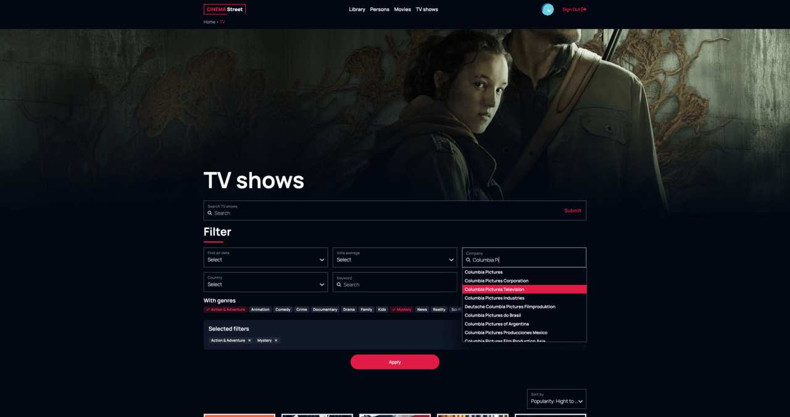

## Screenshots

## Description
Film library. Users have the opportunity to register on the platform, explore information about films, TV series, and actors. They can utilize quick search and filtering options, leave reviews, provide ratings and reactions, connect with other project participants as friends, and create their own collections.

## Link
https://cinema-street.yuliia-tkachenko.dev

## Created with:
Next.js, React, TypeScript, Tailwind, Firebase, TMDB API

Designed and developed by Yuliia Tkachenko, 2024